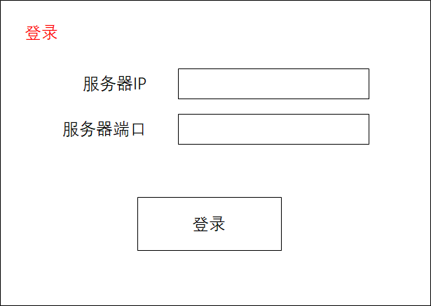
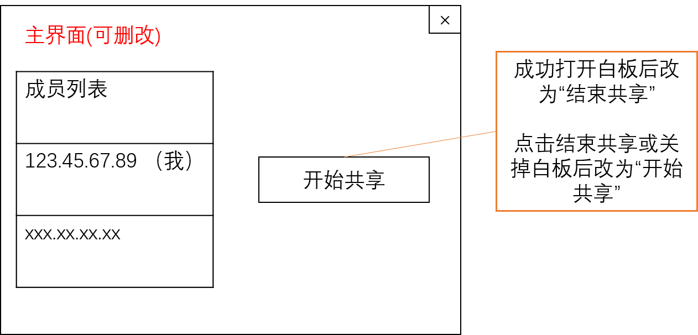
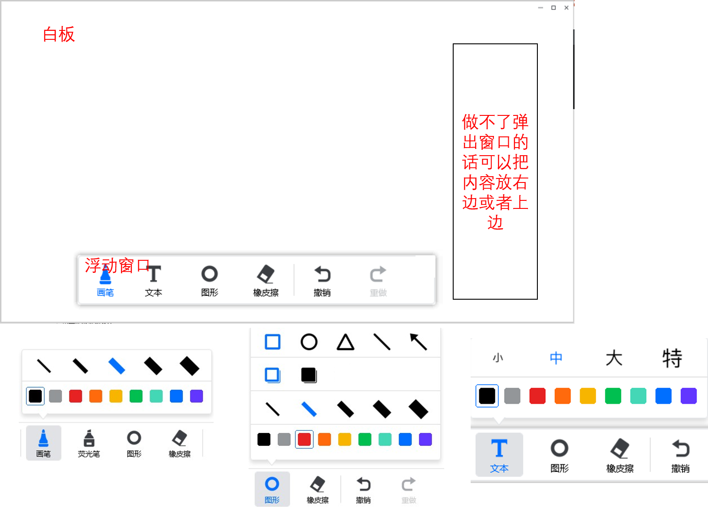
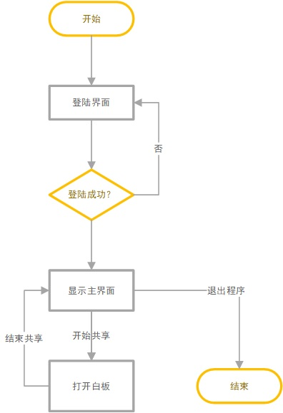

## 界面设计（/文档/GUIx_xxx.png）





## 业务逻辑


## 结构介绍

### 协议设计
/PaintData.py : 应用层的协议设计，要传的数据结构的定义。

### 客户端 /Client/*

/Client/Clinet.py : 客户端主逻辑代码，负责显示各种GUI界面、使用各个模块的功能。

/Client/Conn.py : 连接服务器的类，封装socket。主要有`login`，`sendData`，`recvData`等函数。

/Client/GUI.py : 设计客户端的各个界面，在Client.py中调用。

/Client/GUILogic.py : GUI界面背后的处理逻辑代码，被GUI调用。

### 服务端 /Server/*

/Server/Conn.py : 连接客户端的类，封装socketserver。

/Server/Server.py : 服务端主逻辑代码。处理登录、转发数据等。

## enum枚举类用法
https://docs.python.org/3/library/enum.html
```python
from enum import Enum

class Color(Enum):
    YELLOW = 1
    BLUE = 2

def f(color: Color):
    print(color)
f(Color.BLUE) # 输出 Color.BLUE

Color.BLUE.value # 2
Color.BLUE.name # 'BLUE'
Color(2) # <color.BLUE: 2>
Color['BLUE'] # <color.BLUE: 2>
```